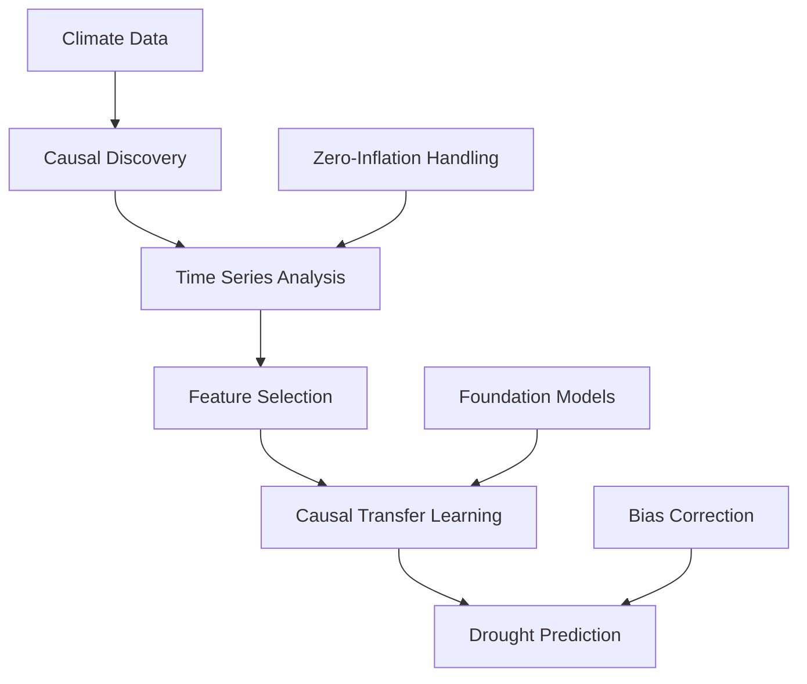

# 🌍 Drought Prediction Using Causal Inference in Climate Change

<div align="center">

[](#)
[](https://github.com/gwt9970161)
[](#)

*Advancing climate prediction through the lens of causal inference and time series forecasting*

</div>

---

## 🎯 Research Focus

**Tags:** `@causality` `@time-series-prediction` `@long-term-forecasting` `@feature-selection` `@causal-transfer-learning`

This research project explores the intersection of **causal inference** and **time series analysis** for drought prediction in the context of climate change. Our work aims to enhance climate model accuracy by addressing unobserved confounders and leveraging advanced machine learning techniques.

---

## 📈 Research Timeline

<details>
<summary><b>🏆 Major Milestones</b></summary>

```
2023-10-05  ✅ Research Proposal Completed
2024-01-17  📝 First IJCAI Paper Submitted
2024-04-25  📝 ECAI Submission
2024-08-12  📝 Second AAAI Paper Completed
2024-09-10  📝 Third ICASSP Paper Completed
2024-11-XX  🎉 First Paper Accepted by AJCAI 2024 (Oral)
2025-XX-XX  🎉 IJCAI 2025 Acceptance
2025-XX-XX  🎉 ECAI 2025 Acceptance
```

</details>

<details>
<summary><b>📊 Submission Status</b></summary>

| Conference | Status | Paper Focus |
|------------|--------|-------------|
| **IJCAI 2025** | ✅ **Accepted** | Deconfounding Multi-Cause Latent Confounders |
| **ECAI 2025** | ✅ **Accepted** | Zero-Inflated Precipitation Prediction |
| **AAAI 2026** | 📤 **Submitted** | Wrapper & DET Approaches |
| **ICLR 2026** | 🔄 **In Prep** | Residual Correction Method |
| **NeurIPS 2025** | 📤 **Submitted** | Foundation Models for SPEI Prediction |

</details>

---

## 📚 Publications

### 🌟 2025 Highlights

<table>
<tr>
<td width="60%">

**Deconfounding Multi-Cause Latent Confounders: A Factor-Model Approach to Climate Model Bias Correction**
- *Authors:* **Wentao Gao**, Jiuyong Li et al.
- *Venue:* IJCAI 2025 (Oral & Poster)
- *Focus:* Factor-model-based bias correction for Global Climate Models

</td>
<td width="40%">

**From Noise to Precision: A Diffusion-Driven Approach to Zero-Inflated Precipitation Prediction**
- *Authors:* **Wentao Gao**, Jiuyong Li et al.
- *Venue:* ECAI 2025 (Oral & Poster)
- *Focus:* Zero Inflation Diffusion Framework (ZIDF)

</td>
</tr>
</table>

### 📖 Complete Publication List

<details>
<summary><b>View All Publications (2023-2025)</b></summary>

#### 🔹 2025
- **Estimating Peer Direct and Indirect Effects in Observational Network Data** - *ICML 2025*
- **Diffusion Models for Attribution** - *AAAI 2025* ([Link](https://ojs.aaai.org/index.php/AAAI/article/view/29492))
- **PCFNet: Enhancing Time Series Forecasting through Preserving Constant Frequency** - *ECAI 2025*
- **G-GLformer: Transformer with GRU Embedding and Global-Local Attention** - *ECML-PKDD 2025*

#### 🔹 2024
- **TSI: A Multi-view Representation Learning Approach for Time Series Forecasting** - *AJCAI 2024* ([Springer](https://link.springer.com/chapter/10.1007/978-981-97-0721-1_23))
- **Instrumental Variable Estimation for Causal Inference in Longitudinal Data** - *AAAI 2024* ([Link](https://ojs.aaai.org/index.php/AAAI/article/view/28712))

#### 🔹 2023
- **A Unified Trajectory Generation Algorithm for Dynamic Dexterous Manipulation** - *IEEE/RSJ IROS 2023* ([IEEE Xplore](https://ieeexplore.ieee.org/document/10342202))

</details>

---

## 🔬 Research Framework

### Core Components



### Key Research Areas

<div align="center">

| 🎯 **Causal Inference** | 📈 **Time Series** | 🌡️ **Climate Modeling** |
|:---:|:---:|:---:|
| Deconfounding Methods | LSTM/Transformer | NCEP-NCAR Analysis |
| Graphical Models | Multi-view Learning | Precipitation Prediction |
| IV Estimation | Foundation Models | SPEI Forecasting |

</div>

---

## 🛠️ Tools & Resources

### 📦 Developed Tools
- **[Zero Inflation Simulation](https://github.com/Wentao-Gao/Zero_inflation_data_simulation)** - Implementation for zero-inflated data simulation
- **[Climate Data Processing](https://github.com/gwt9970161/Climate-Change-in-Data-Science)** - NetCDF to CSV conversion tools

### 📊 Key Datasets
- **NCEP-NCAR Reanalysis 1** - Primary climate dataset
- **[El Niño Data](https://psl.noaa.gov/data/timeseries/month/DS/Nino4/)** - Oceanic indices

### 🔧 Causality Toolboxes

| Tool | Description | Language |
|------|-------------|----------|
| [DoWhy](https://github.com/microsoft/dowhy) | Causal inference in Python | Python |
| [CausalML](https://github.com/uber/causalml) | Uplift modeling & treatment effects | Python |
| [Tigramite](https://github.com/jakobrunge/tigramite) | Causal discovery for time series | Python |
| [gCastle](https://github.com/huawei-noah/trustworthyAI) | Comprehensive causal discovery | Python |

---

## 🎓 Learning Resources

### 📖 Recommended Reading
- **[Causality: A Brief Intro](https://www.researchgate.net/publication/374233586_Causality_A_Brief_Intro)** - Quick causality overview
- **[AI Lecture Notes](https://wentao-gao.notion.site/Bristol-Intro-to-AI-8ba5854a9a8e49d9a2e1659af5446fa3)** - Introduction to AI (Chinese)
- **[Time Series Deconfounder Blog](https://zhuanlan.zhihu.com/p/681178681)** - Technical blog post

### 🔗 Useful Links
- **[Weekly Reports](https://github.com/Wentao-Gao/Climate-Change-in-Data-Science/tree/main/Weekly%20Report)** - Detailed progress tracking
- **[Domain Adaptation Papers](link-to-collection)** - Curated paper collection

---

## 🚀 Next Steps

<div align="center">

### 🎯 Current Focus
**Leveraging Frozen Time Series Foundation Models for Enhanced Prediction**

</div>

### Upcoming Work
- [ ] **AAAI 2026** - Wrapper and DET methodology papers
- [ ] **ICLR 2026** - Residual correction approach
- [ ] **Foundation Model Integration** - Zero-shot climate prediction
- [ ] **Comprehensive Evaluation** - Multi-dataset validation

---

## 📞 Contact & Collaboration

<div align="center">

**Wentao Gao** - PhD Researcher in Causal Climate Modeling

[](https://github.com/gwt9970161/Climate-Change-in-Data-Science)
[](mailto:your-email@domain.com)
[](https://www.researchgate.net/profile/Wentao-Gao)

*If this work helps your research, please ⭐ star and follow! Questions and collaborations are always welcome.*

</div>

---

<div align="center">
<i>🌱 Contributing to sustainable climate prediction through innovative AI and causal inference methods</i>
</div>
